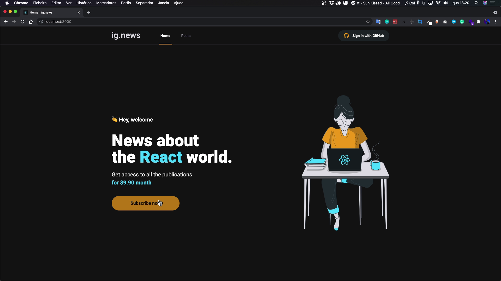
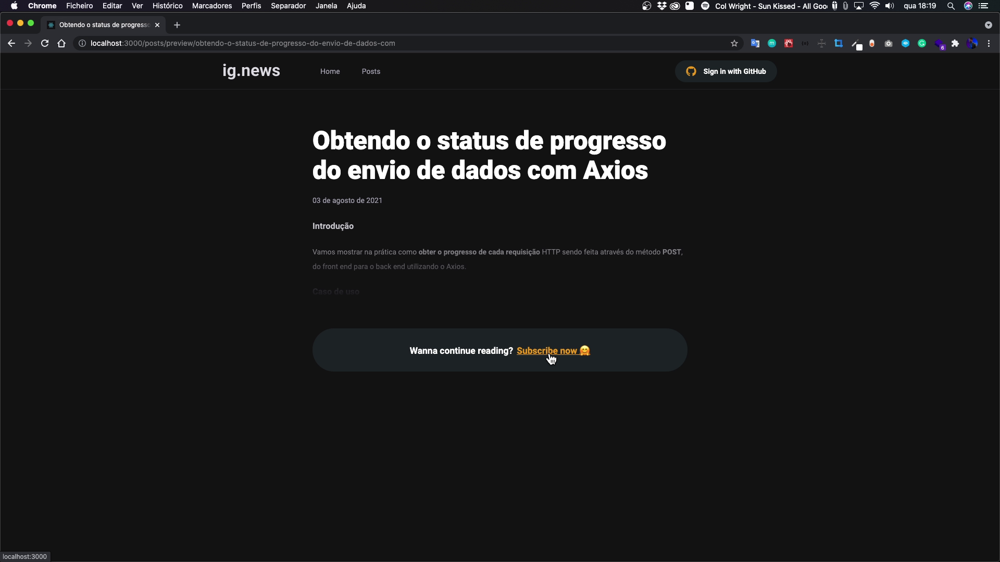
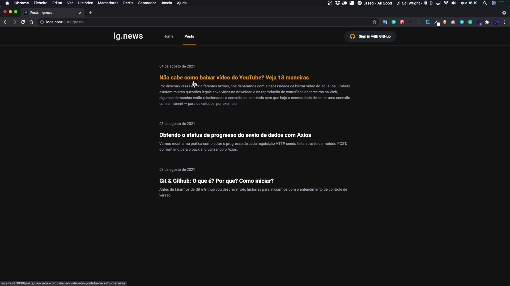
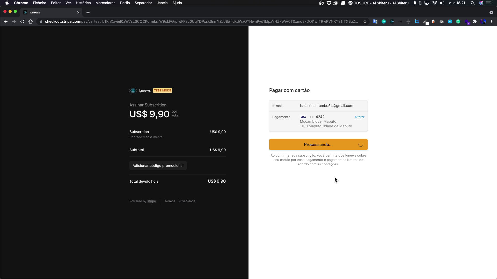

<br/>
<p align="center">
     
</p>

<h2 align="center"> 


<!--  -->

</h2>
<br>

<p align="center">
<a href="#-tecnologias-usadas">Tecnologias usadas</a>&nbsp;&nbsp;&nbsp;|&nbsp;&nbsp;&nbsp;
<a href="#-pré-requisitos">Pré-requisitos</a>&nbsp;&nbsp;&nbsp;|&nbsp;&nbsp;&nbsp;
<a href="#-como-rodar-o-projecto">Como rodar o projecto</a>
</p>
<p align="center">
       
</p>
<p align="center">
O <span>ignews</span> é aplicativo com a funcionalidades de um blog de assinatura como o medium que foi construindo no Bootcamp Ignite da rockeseat na trilha Reactjs,

<!-- <h1 align="center"><a target="_blank" href="https://letmeask-3fc59.web.app/">Acessar Demonstração</a></h1> -->

## ✅ Features
  - [x] Fazer pagamento com o Stripe
  - [x] Fazer Login com o Github
  - [x] Listar Postagens do Prismic
  - [x] Guardar dados no FaunaDB
  - [x] Gerar paginas estáticas
  - [x] Testes com Jest 


<p align="center">
  
     
     
</p>

---
## 🛠 Tecnologias usadas

As seguintes ferramentas foram usadas na construção do projeto:


- ReactJs
- Nextjs
- Typescript
- SASS
- Axios
- Stripe
- FaunaDB
- Next-auth
- React-icons
- Jest


---

## ⚠ Pré-requisitos

Antes de começar, você vai precisar ter instalado em sua máquina as seguintes ferramentas:
[Git](https://git-scm.com), [Node.js](https://nodejs.org/en/). 
Além disto é bom ter um editor para trabalhar com o código como [VSCode](https://code.visualstudio.com/)

---
## 🎲 Como rodar o projecto

```bash
# Clone este repositório


# Acesse a pasta do projeto no terminal/cmd
$ cd ignews

# Abra a pasta no Visual Studio Code
$ code .

# Instale as dependência
$ yarn

# Configure as variáveis de ambiente do projeto

# Execute a aplicação com o yarn
$ yarn dev

# O servidor iniciara na porta:3000 - acesse <http://localhost:3000>
```

---


